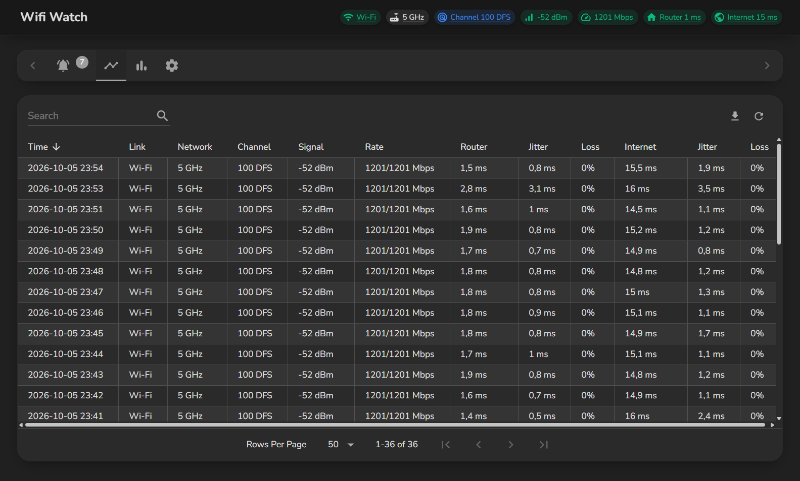
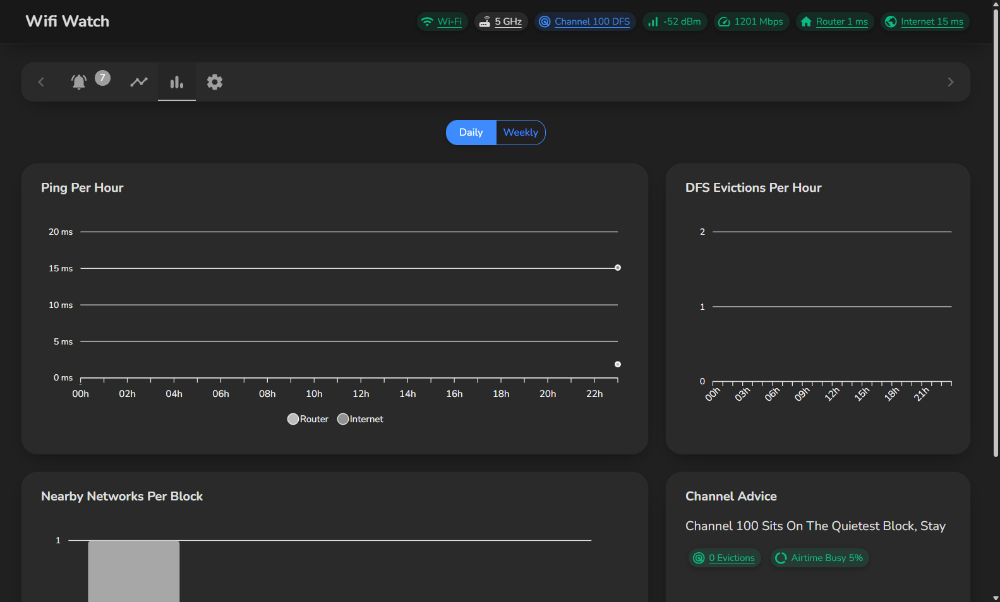

# Wifi Watch

Watches Your Wi-Fi Channel, Signal And Ping And Logs Every Change

## Features
- Live Status Bar: Link, Network, Channel With DFS Marker, Signal, Link Rate, Router And Internet Ping
- Alerts The Moment Radar Pushes Your Router Off A DFS Channel, And When It Comes Back
- Alerts For Disconnects, Band Drops, Weak Signal, Slow Link, Ping And Jitter Spikes, Packet Loss And Internet Outages
- Traces Every Internet Outage To Show Whether It Stops At Your Router Or Inside The Provider Network
- Scans Nearby Networks Every 5 Minutes And Advises The Quietest 80 MHz Channel Block
- Per Minute Log Of Signal, Rates, Ping, Jitter And Loss, Searchable And Sortable
- Event Log With Coloured Kinds, Filters And Search
- Daily And Weekly Charts For Ping, DFS Evictions And Nearby Networks
- Export Any Day Or Everything To CSV
- Every Problem Chip Opens The Fix: Location, Wi-Fi, Network Or Router Settings
- Adjustable Alert Thresholds
- Starts With Windows Hidden In The Tray, Minimise Goes To The Tray, Closing Asks First
- Checks GitHub Daily For A New Version
- Nothing Is Ever Deleted, Everything Stays On Your PC

## Quick Start
1. Download And Run The Exe
2. Turn On Location Services If Asked, Windows Hides Wi-Fi Details Without It
3. Let It Run, It Lives In The Tray

## ⚠️ Important
- Windows 11 Only Shares Wi-Fi Details With Location Services On
- Wi-Fi Details Are Read Through `netsh`, Which Needs Windows In English
- The Router Settings Link Opens Port 8443, The ASUS Default

## Technical Details
- Windows App Built With C# And WPF On .NET 10, Its Interface In Blazor Through BlazorWebView
- MudBlazor Interface, ApexCharts For The Charts
- Data Lives In SQLite Under %AppData%\WifiWatch Through Entity Framework Core

## Download
Get The Latest Version From The [Latest Release](https://github.com/poolfullofmilk/WifiWatch/releases/latest)
