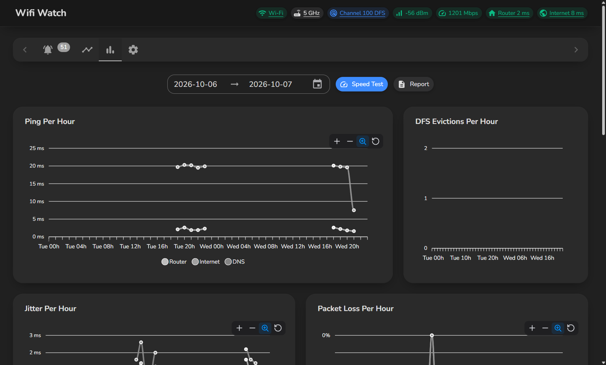
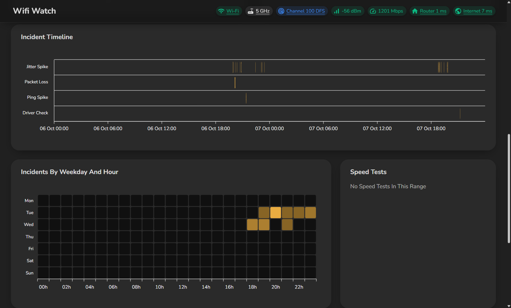
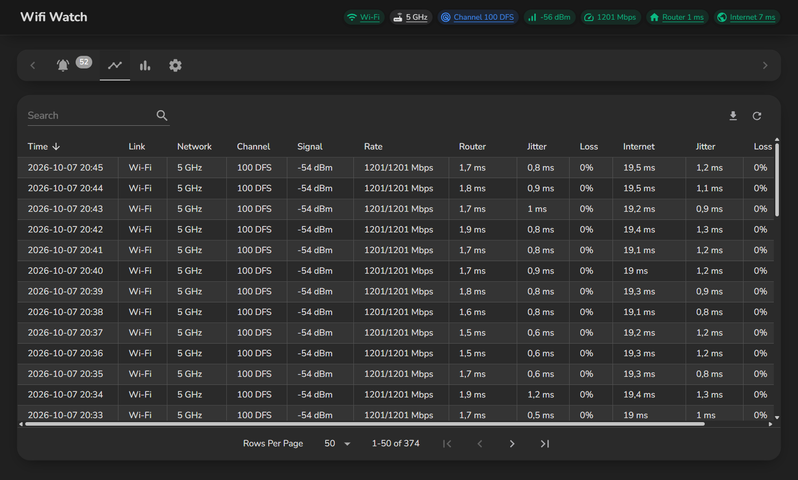

# Wifi Watch

Watches Your Wi-Fi Channel, Signal And Ping And Logs Every Problem

## Features
- Live status bar: channel with DFS marker, signal, link rate, router and internet ping
- Logs problems as incidents with a start, an end and where they sit: Wi-Fi, home network, internet provider or DNS
- Only notifies for serious problems, or ones that last
- Alerts when radar pushes your router off a DFS channel, and says when it may come back
- Shows the reason Windows gives for every disconnect
- Traces incidents to show whether they stop at your router or inside the provider network
- Times DNS lookups next to 1.1.1.1
- Speed test with lag under load and a grade, optionally every night
- Daily and weekly summaries
- Checks your Wi-Fi driver age and power saving
- Charts per hour or day over any date range, with an incident timeline and a weekday heatmap
- Saves a report to send to your provider, and exports to CSV
- Updates itself from GitHub releases
- Lives in the tray and starts with Windows
- Everything stays on your PC

## Quick start
1. Download and run the exe from the [latest release](https://github.com/poolfullofmilk/WifiWatch/releases/latest)
2. Turn on location services if asked
3. Let it run in the tray

## ⚠️ Important
- Windows 11 only shares Wi-Fi details with location services on
- Wi-Fi details are read through `netsh`, which needs Windows in English
- Channel advice follows EU channel rules

## Technical details
- C# and WPF on .NET 10, with a Blazor interface through BlazorWebView
- MudBlazor, ApexCharts and SQLite through Entity Framework Core
- Split into Data, Services and Desktop projects
