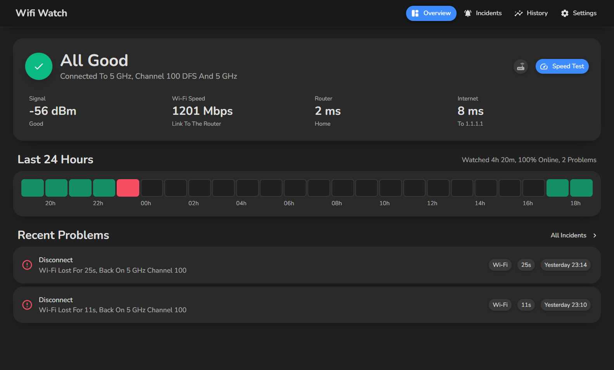
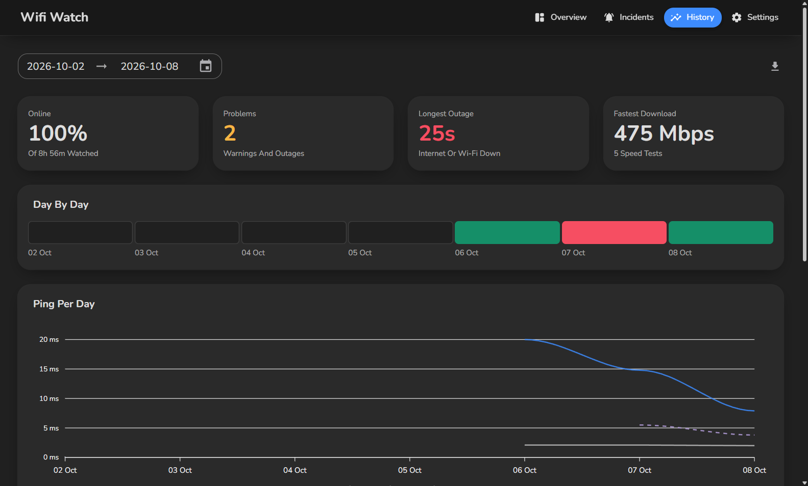
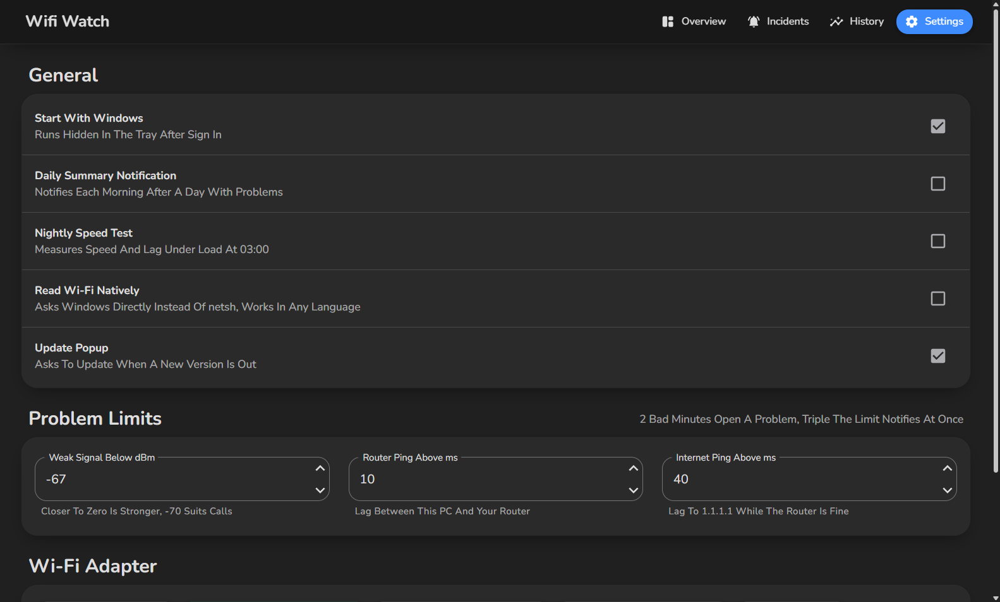

# Wifi Watch

Tells you if your connection is fine, and when it wasn't, where it went wrong and what to do.

## Features
- Live status of your Wi-Fi, router and internet, and a tray icon that turns amber or red when something is wrong
- Logs every problem with where it was (Wi-Fi, home network, provider or DNS) and what to do about it
- Notifies you only when something serious happens or lasts
- History per hour or day, every Wi-Fi channel and who else is on it, and radar warnings for DFS channels
- A speed test with live progress and lag under load

## Quick start
1. Download the exe from the [latest release](https://github.com/poolfullofmilk/WifiWatch/releases/latest)
2. Run it and turn on location services if asked

## ⚠️ Important
- Needs Windows 11 with location services on
- On Windows in another language than English, turn on Read Wi-Fi Natively in Settings

## Technical details
- .NET 10, WPF with Blazor, MudBlazor and SQLite
